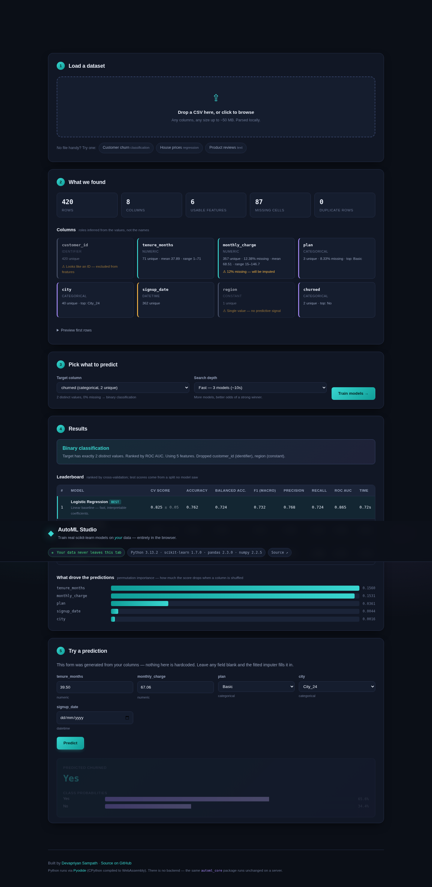

# AutoML Studio

**Upload any CSV. Get a trained, evaluated, explained model. No server involved.**

[](https://devapriyan-s.github.io/automl-studio/)
[](https://github.com/Devapriyan-S/automl-studio/actions/workflows/tests.yml)
[](https://python.org)
[](LICENSE)

### ▶ [**Open the live demo**](https://devapriyan-s.github.io/automl-studio/) — no signup, no upload, works offline after first load



---

## What this is

Most portfolio ML projects hardcode one dataset:

```python
df = pd.read_csv("titanic.csv")
X = df[["age", "fare", "pclass"]]      # breaks on literally any other file
```

This one doesn't know anything about your data until you hand it over. Drop in a
CSV and it infers what every column *is*, works out whether you're asking for
classification or regression, builds the matching preprocessing pipeline, trains
a family of models, ranks them honestly, and generates an input form from your
schema so you can make live predictions.

**The demo runs entirely in your browser.** Python, scikit-learn, pandas and
numpy are compiled to WebAssembly via [Pyodide](https://pyodide.org) and execute
in a Web Worker. There is no backend, no upload, and no cost to keep it online —
your CSV never crosses the network.

---

## What "dynamic" actually required

The interesting problems here were not "call `.fit()`". They were:

| Problem | How it's handled |
|---|---|
| **What type is this column?** | Values decide, not names. Integers with ≤12 levels are categories; `"2019-04-01"` is a date but bare `2019` isn't; long strings are text, short repeated ones are categories. |
| **Is `price` an ID or a feature?** | An all-unique integer column is only an identifier if it *densely fills a contiguous range*. A row index (`0..499`, span 500) is. A rounded price (`200k..900k`, span 700k) is not. Getting this wrong silently turned a regression into a 4-class classification during development. |
| **Regression or classification?** | Inferred from the target's dtype and cardinality, biased toward regression — silently turning a continuous target into 12 classes is far more damaging than the reverse. |
| **Unseen categories at predict time** | Preprocessing lives *inside* the `Pipeline`, so `handle_unknown="ignore"` handles a category the model never trained on instead of throwing. |
| **Missing / extra / reordered input fields** | `predict()` re-adds absent columns as `NaN` for the fitted imputer and drops unknown ones. |
| **Class imbalance** | Detected automatically; switches the ranking metric off accuracy and turns on `class_weight="balanced"`. |
| **Dates** | Expanded to calendar parts, with month/weekday/hour as sin·cos pairs so December sits next to January. |
| **Free text** | TF-IDF → truncated SVD, as one branch of the same `ColumnTransformer`. |
| **Booleans** | Cast to strings before imputation — scikit-learn's imputers reject `bool` dtype outright. |

---

## Honest evaluation

A leaderboard is easy to inflate. This one is built to resist it:

- **Model selection uses cross-validation on a training split.** The headline
  numbers come from a **held-out test split the search never touched.**
- **Overfitting is labelled, not hidden.** When a model's CV score exceeds its
  test score by more than 0.15 it gets an `overfit` tag and the run reports:
  *"Trust the test score, not the CV score."*
- **The run warns about itself** — too few rows, more features than rows/10,
  duplicate rows that can leak across the split, imbalanced classes.
- **Feature importance is permutation-based**, so it is model-agnostic and
  measures real predictive contribution rather than a tree's split counts.

On a 40-row × 25-column dataset the tool reports CV 0.94 / test 0.56 and says so
in plain language. That is the behaviour I wanted: a portfolio project that tells
you when its own number is not trustworthy.

---

## Architecture

```
automl_core/           the engine — pure numpy/pandas/scikit-learn, no I/O
  profiling.py         column-role inference + data-quality report
  task.py              regression vs binary vs multiclass detection
  preprocess.py        ColumnTransformer assembly (num/cat/date/text branches)
  models.py            candidate zoo, Pyodide-compatible by construction
  engine.py            CV search, honest evaluation, prediction, warnings
  serialize.py         joblib bundle + JSON sidecar

web/                   static demo — vanilla HTML/CSS/JS, zero dependencies
  js/worker.js         Pyodide in a Web Worker (training must not block the UI)
  py/bridge.py         narrow JSON boundary between JS and Python
  py/automl_core/      generated by build.py — never edited by hand

api/main.py            the same engine behind FastAPI, to show it ports cleanly
tests/                 six deliberately awkward datasets, end-to-end
```

`automl_core` has no knowledge of the browser, and `web/` has no ML logic. The
JS↔Python boundary carries only JSON strings, so no Python object ever crosses
it. `python build.py` copies the engine into `web/py/` — one source of truth.

---

## Run it locally

```bash
git clone https://github.com/Devapriyan-S/automl-studio.git
cd automl-studio
python -m venv .venv && source .venv/bin/activate
pip install -r requirements.txt

python tests/test_engine.py        # six datasets, end to end
python build.py                    # sync engine -> web/py/
python -m http.server 8000 -d web  # open http://localhost:8000
```

Use it as a library:

```python
import pandas as pd
from automl_core import AutoMLEngine, save

engine = AutoMLEngine(preset="full").fit(pd.read_csv("anything.csv"), target="churned")

print(engine.task.kind)          # binary_classification
print(engine.leaderboard[0])     # winner, CV score, held-out test metrics
print(engine.warnings)           # plain-language caveats about this run
print(engine.feature_importance())

engine.predict([{"tenure_months": 12, "plan": "Basic"}])   # missing cols are fine
save(engine, "models/churn")     # -> churn.joblib + churn.meta.json
```

Or behind an HTTP API:

```bash
pip install -r requirements-api.txt
uvicorn api.main:app --reload     # docs at http://127.0.0.1:8000/docs
```

---

## Testing

`tests/test_engine.py` runs the full pipeline against six datasets built to
break it: mixed types with missing values and an ID column, multiclass, pure
regression, free text, 6% class imbalance, and a 40×26 wide-and-tiny set. Each
one also round-trips a prediction through `save()`/`load()` **with a required
field deleted and an unknown field added**, and asserts the reloaded model
returns the identical answer.

The browser build is verified separately with Playwright driving real Chrome —
Pyodide boot, all three sample datasets, the generated form, and a mobile
viewport overflow check.

---

## Limits

- **First load pulls ~12 MB** of WebAssembly runtime. It is cached afterwards,
  but the initial visit takes ~10 s on a good connection.
- **Browser training is single-threaded** and suited to datasets up to roughly
  100k cells. Beyond that, use the Python package or the API directly.
- **No hyperparameter tuning.** Candidates use sensible fixed settings; a
  proper search would add a `RandomizedSearchCV` stage. Deliberate scope cut.
- **The API registry is in-process**, so models are lost on restart.

---

MIT licensed. Built by [Devapriyan Sampath](https://github.com/Devapriyan-S).
